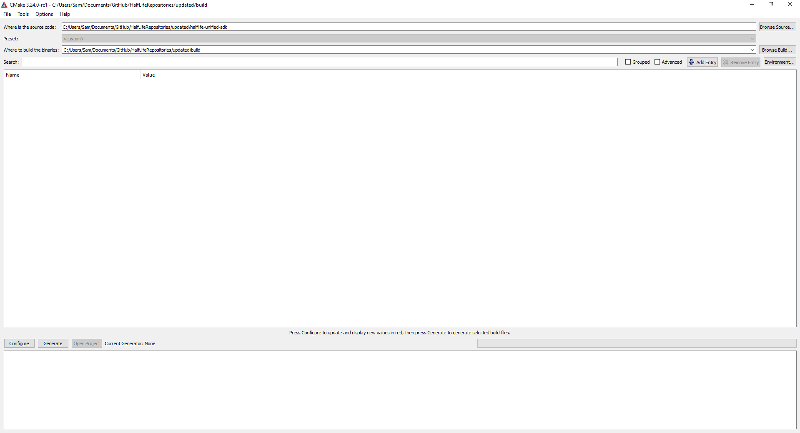
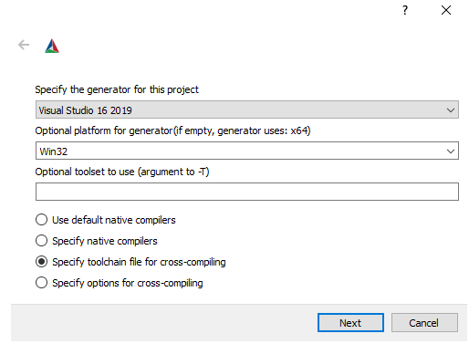
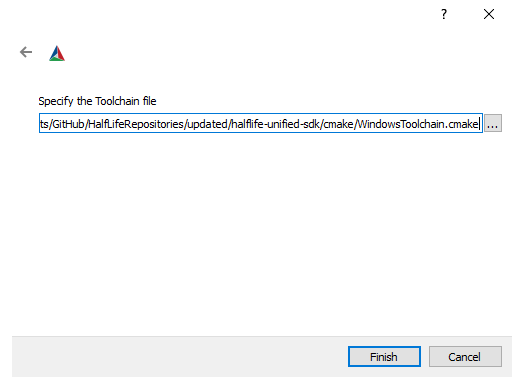
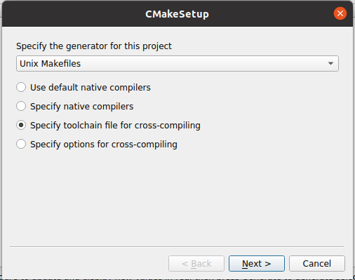
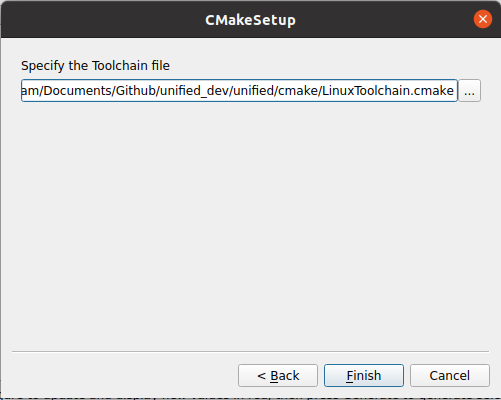
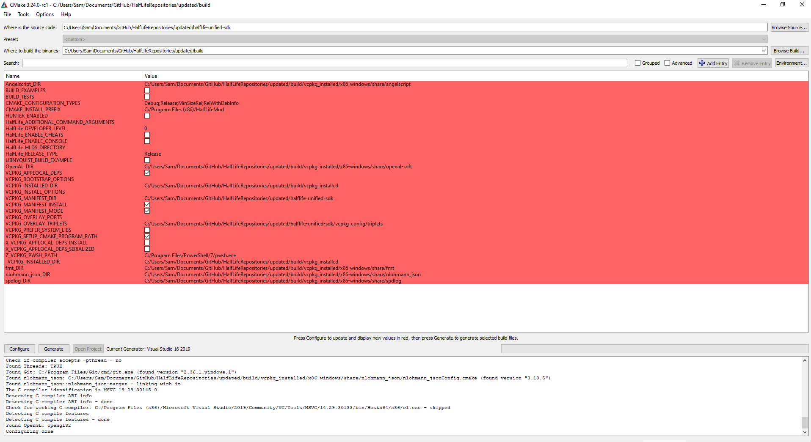

# Building this SDK

This tutorial expects a strong grasp of of C++, build systems like Visual Studio or Make (depending on the platform you're developing for), CMake, command line interfaces and version control systems (Git in particular).

All instructions for Linux development are written to apply to Ubuntu. Substitute commands and actions as needed for your distribution. It is expected that you understand how to work with the Linux terminal and command line.

## Minimum requirements

The minimum requirements for this project are:
* [CMake 3.23 or newer](https://cmake.org/download/) (**Note**: avoid versions 3.28 and 3.28.1 as they fail to download vcpkg dependencies. See [this](https://github.com/microsoft/vcpkg/issues/33904) issue for more information)

### For Windows development

* Windows 7 or newer
* [Visual Studio 2019 or newer](https://visualstudio.microsoft.com/downloads/)
    * During installation you will need to configure the installer to include a few components:
        * Workloads:
        	* Desktop development with C++
    * Individual components:
        * MSVC v142 - VS2019 C++ x64/x86 build tools (Latest) (or newer if you are using a newer version of Visual Studio)
        * C++ profiling tools
        * Windows 10 SDK (select the latest version)

> **Note**: vcpkg uses the latest version of Visual Studio installed on your system to compile dependencies. Using an older version of Visual Studio to compile the SDK itself may cause compiler errors. Always use the latest installed version of Visual Studio to build the SDK.

### For Linux development

* [The minimum requirements for Steam itself](https://github.com/ValveSoftware/steam-for-linux#hardware-and-software-requirements)

The following packages are required:
* build-essential
* g++-11-multilib (See [this](https://lindevs.com/install-g-on-ubuntu/) article for instructions on installing it if this package is not available in your default package repositories)
* libgl1-mesa-dev:i386 (you will need to execute `dpkg --add-architecture i386` first to add this package)

## Clone the repository

Clone the repository. Since it uses submodules you will need to make sure they are cloned as well.

The following git command will clone the repository with submodules into the directory `<current_dir>/halflife-unified-sdk`:
```sh
cd path/to/where/you/want/source/code
git clone --recurse-submodules https://github.com/twhl-community/halflife-unified-sdk.git
```

It is recommended to put the source code directory in a directory of its own:
```sh
cd path/to/directory/halflife-unified-sdk_dev
git clone --recurse-submodules https://github.com/twhl-community/halflife-unified-sdk.git
```

This makes it easier to group related directories and files together.

If you do not have any experience working with Git, it is recommended to download and install [Sourcetree](https://www.sourcetreeapp.com) and following this tutorial: https://www.youtube.com/watch?v=5K4gong_lA0

Make sure to open the `Advanced Options` menu on the Clone page and tick the `Recurse submodules` option.

## Change the mod name

The name of your mod as seen in the game window title, Task Manager and Steam is defined in `config/liblist.gam.in`.

Open this file in a text editor and change the line:
```
game "Half-Life Unified SDK"
```

To use the name of your mod.

You should commit this change to version control.

## Generate the project files

Start the CMake GUI; you will see a few options. Let's go over the ones we'll need to set up to generate the project files.

* "Where is the source code": This should point to the directory that you cloned the repository to
* "Where to build the binaries": This is where the actual project files will be generated. It is recommended to create a directory next to the source code directory and name it `<source code directory>_build`, which makes it obvious that the directory belongs to that repository. This will be referred to as the build directory from now on

A typical setup should look like this:



If a problem occurs where CMake repeatedly fails to find third party dependencies, deleting the CMake cache and regenerating everything can help to solve problems related to cached data.

### Windows configuration

Now click the `Configure` button on the bottom left part of the screen. You will see this dialog:



Enter the following settings:
* Generator: Visual Studio 16 2019 (or newer if you prefer)
* Platform: Win32
* Specify toolchain file for cross-compiling

Click the `Next` button. You will now see this dialog:



Browse to the source code directory, open the `cmake` directory and select the file `WindowsToolchain.cmake`.

Click the `Finish` button. CMake will now perform first-run setup to prepare for project generation.

### Linux configuration

Now click the `Configure` button on the bottom left part of the screen. You will see this dialog:



Enter the following settings:
* Generator: Unix makefiles
* Specify toolchain file for cross-compiling

Click the `Next` button. You will now see this dialog:



Browse to the source code directory, open the `cmake` directory and select the file `LinuxToolchain.cmake`.

Click the `Finish` button. CMake will now perform first-run setup to prepare for project generation.

### Continue configuration

CMake will now perform its initial configuration. vcpkg will run as well and will download, build, install and check all dependencies. This will take some time, but is only performed if the dependencies are updated, changed, deleted or otherwise modified in a way that vcpkg detects as requiring a rebuild.

You should now see new variables marked red:



Modify the `CMAKE_INSTALL_PREFIX` variable to point to your mod directory, e.g. `C:/Program Files (x86)/Steam/steamapps/common/Half-Life/hlu`.

Substitute `hlu` with the name of your mod directory. This name should be short and unique, and should ideally contain only lowercase alphabetical, underscore and number characters.

If you want to launch a dedicated server through Visual Studio you will need to point the `HalfLife_HLDS_DIRECTORY` variable to the directory that contains `hlds.exe`/`hlds_linux`.

To aid developers project info is displayed on-screen automatically if `HalfLife_RELEASE_TYPE` is set to `Pre-Alpha` or `Alpha`. Configure this variable as needed to suit your needs. This is used solely for in-game diagnostics messages and display and does not affect the source code in any way. See [Hud Project info](docs/features/hud-project-info.md) for more information.

You can set up the game for debugging by using these optional variables to provide command line arguments to the game:
* `HalfLife_ENABLE_CONSOLE`: If set, the console will be enabled on startup
* `HalfLife_ENABLE_CHEATS`: If set, cheats will be enabled on startup
* `HalfLife_DEVELOPER_LEVEL`: Sets the developer level to the given setting. Higher levels enable more console output and turn some runtime warnings into fatal errors
* `HalfLife_ADDITIONAL_COMMAND_ARGUMENTS`: Any additional command line arguments you require can be added here, for example to load the game into the map `c2a5` on startup you can add `+map c2a5`

Once all variables have been set, click the `Generate` button to generate the project files.

## Opening the project files

### On Windows

Open Visual Studio and open the solution file `HalfLifeMod.sln` that has been created in the build directory.

Visual Studio will open the solution and list 4 projects:
* ALL_BUILD: this is a CMake utility project used to build all projects in the solution
* ZERO_CHECK: Re-runs CMake when built
* INSTALL: this is a CMake utility project used to build all projects and install files to the destination set in `CMAKE_INSTALL_PREFIX`. It installs the mod libraries as well as debug info to the mod directory
* client: this is the Half-Life mod client project
* server: this is the Half-Life mod server project
* ProjectInfo: Regenerates the project info shown on the HUD. This project is automatically built when the client or server are built

The debugging settings have been initialized to point to your mod directory and the startup project has been set to the client, so all you need to do is build the `INSTALL` project and once completed press F5 to launch the game with your mod. Steam needs to be running for the game to launch successfully.

If all goes well you should now be able to make changes to your code, build the `INSTALL` project and press F5 to test your changes.

### On Linux

Open a terminal and change directory to the build directory:
```sh
cd path/to/build
```

Enter this command:
```sh
make install
```

This will compile your mod and copy the client and server libraries to the mod installation.

Restart Steam and you will be able to run your mod.
