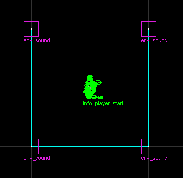

# Sound System

The Unified SDK provides a new sound system to fix bugs and increase or remove some limits.

The sound system provides support for music, sound and sentence playback.

The sound system uses OpenAL to handle sample mixing, distance attenuation and other sound properties and effects.

The following file formats are supported:
* Wave (+ IMA-ADPCM encoding)
* MP3
* Ogg Vorbis
* Ogg Opus
* FLAC
* WavPack
* Musepack

> <span style="background-color:darkseagreen; color: black">
> Note
></br>
> The OpenAL library is named `openal-hlu.dll` to avoid conflicting with the library used by the engine on Linux which is an older version of OpenAL.</span>

The sound system uses several loggers for different subsystems:
| Name | Purpose |
| --- | --- |
| sentences | Logs diagnostics, warnings and errors that occur during `sentences.json` file loading |
| sound | Logs diagnostics, warnings and errors that occur during sound playback |
| sound.cache | The client-side sound cache |
| sound.sentences | The client-side sentences system |

## Music playback

Music playback is similar to the engine's music playback with the following differences:

* Music does not stop on level change
* Has no internal file count limit

The `MP3Volume` engine cvar controls music volume and is set by the music volume slider in the options dialog.

### Entities

* [ambient_music](../entityguide/entities/ambient_music.md)

### Console commands

#### music

Syntax: `music <command> [arguments]`

The `music` command handles all music playback. It is the equivalent of the engine's `cd` and `mp3` commands.

Commands:
| Name | Purpose |
| --- | --- |
| on | Enables music playback |
| off | Disables music playback and stops any music that is currently playing |
| reset | Enables music playback and stops any music that is currently playing |
| play <relative_filename> | Plays the specified file |
| loop <relative_filename> | Loops the specified file |
| stop | Stops any music that is currently playing |
| fadeout | Fades out and stops any music that is currently playing. Uses the `MP3FadeTime` engine cvar to control fadeout time |
| pause | Pauses any music that is currently playing |
| resume | Resumes music if it was paused |
| info | If any music is playing or paused, prints the current filename. The volume is also printed |

## Sound and sentence playback

Sound and sentence playback relies on OpenAL for distance attenuation, volume and room effects using the EFX extension (OpenAL's version of the EAX extension).

Room effects use almost identical parameters to the EAX implementation that was once used by the game but since the original implementation used software mixing and fixed position 3D sound sources the results aren't identical.

Half-Life, like Quake, uses software mixing regardless of which audio API is used to actually play it. This means distance calculations are done before the audio is sent to the EAX 3D sound sources.  
  
To avoid duplicating distance effects Half-Life has 4 3D sources placed around the player. If you imagine a box 2x2 units wide and long centered on the player, the sources are placed at the corners of the box:



(Image not to scale)

The new sound system lets OpenAL handle distance calculations so sound sources are handled properly by the EFX extension. The sound effects are working properly, but sound different from the original effects.

The effects do sound correct in-game but it's always going to be different.

The `volume` engine cvar controls sound volume and is set by the sound effects volume slider in the options dialog.

### Changes to sound system limitations

* Added support for **multiple sentences configuration files** along with the ability to **redefine sentences and sentence groups**
* Maximum number of concurrent sounds of all kinds (static, dynamic, ambient): was **128**, now **unlimited**
* Maximum number of **sound precaches**: from **512** to **65535**
* Maximum number of **sentences**: was **1536**, now **65535**
* Maximum number of **sentence groups**: was **200**, now **unlimited**
* Reworked sentence groups to **allow sentences to be non-sequential**
* Maximum number of **sentences in a group**: was **32**, now **unlimited**
* Maximum **sentence name length**: was **15** ASCII characters, now **unlimited**
* Maximum number of **words in a sentence**: was **32**, now **unlimited**
* Maximum number of **unique sounds** (server + client side sounds): was **1024**, now **unlimited**
* Maximum sentence line length: was **511** characters, now **unlimited**
* **Sentences are no longer cut off after pausing and resuming**
* Implemented **EAX** effects
* Implemented **Aureal A3D** functionality using **HRTF** (note: experimental)
* Made sounds with attenuation 0 play at player's position (fixes `ambient_generic` **Play Everywhere** sounds still using spatialization)

### Sentences configuration files

Half-Life's `sentences.txt` file has been replaced with a JSON-based alternative. The Unified SDK supports multiple files and allows sentences and sentence groups to be redefined allowing for map-specific replacements and additions.

The default file loaded by default is `sound/sentences.json`. Additional files can be added using map configuration files.

#### Syntax

A sentences file contains an object with two optional fields: the `Sentences` array and the `Groups` object.

The `Sentences` array contains sentence definitions. Each sentence is a string containing the sentence name following by the words in the sentence. The syntax for sentences is identical to `sentences.txt` and can be found [here](https://twhl.info/wiki/page/Sentences.txt).

Unlike `sentences.txt` the sentence name does not create sentence groups. To create a group an entry in the `Groups` object must be created. Each entry is an array of sentence names contained in the group.

This avoids the accidental creation of sentence groups, allows multiple groups to use the same sentences and allows groups to be redefined without having to redefine the sentences as well.

It is not required for sentence names to match the group name but it is advised to follow the original sentence naming convention for clarity.

Sentences and groups can be redefined in another configuration file if it is loaded after the file they were defined in. The syntax is identical; if a sentence or group with the same name is encountered the contents are replaced. If a group is redefined to one with fewer sentences the additional sentences are also removed from the group.

#### Example

```jsonc
{
	"Sentences": [
		// Defines a sentence with a single word
		"NULLSENT common/null",
		// Also defines a sentence with a single word, but does not create a group
		"NULLGR0 common/null",
	
		// Defines 7 sentences with words, does not create a group
		"HG_GREN0 hgrunt/clik(p120) grenade! clik",
		"HG_GREN1 hgrunt/(t30) clik take!(e75) cover!(s5) clik",
		"HG_GREN2 hgrunt/clik clik oh! shit! clik",
		"HG_GREN3 hgrunt/(p110 t40) clik(p120) get!(e78) down!(t30) clik",
		"HG_GREN4 hgrunt/clik(p110) (t40) of!(e75) god! clik(p110)",
		"HG_GREN5 hgrunt/clik no! clik",
		"HG_GREN6 hgrunt/clik move! clik(p120)"
	],
	"Groups": {
		// Defines a group called "NULLGR" with one sentence "NULLGR0" in it
		"NULLGR": [
			"NULLGR0"
		],
		// Defines a group called "HG_GREN" with 7 sentences in it
		"HG_GREN": [
			"HG_GREN0",
			"HG_GREN1",
			"HG_GREN2",
			"HG_GREN3",
			"HG_GREN4",
			"HG_GREN5",
			"HG_GREN6"
		]
	}
}
```

### See Also

* [Sentences section](game-configuration-system.md#sentences)

### Console commands and variables

#### cl_snd_room_off

Syntax: `cl_snd_room_off <1|0>` (Default `0`)

Like the engine's `room_off` cvar this controls whether the EFX-based room effects are disabled. When disabled all sounds play as if room type 0 is used.

#### cl_snd_playstatic and cl_snd_playdynamic

Syntax: `cl_snd_playstatic|cl_snd_playdynamic <sound_name> [volume] [attenuation] [pitch]`

These commands play a sound on the player entity. Static sounds are played on a `CHAN_STATIC` channel, dynamic sounds are played on a `CHAN_VOICE` channel.

Default values:
| Name | Value | Range | |
| --- | --- | --- | --- |
| volume | 1 | [0, 1] | |
| attenuation | 0.8 | [0, +infinity] | **0.8** is normal attenuation, equivalent to `ambient_generic` large radius |
| pitch | 100 | [1, 255] | **100** is normal, unaltered pitch |

#### cl_snd_stopsound

Syntax: `cl_snd_stopsound`

Stops all sounds that are currently playing.

#### cl_snd_hrtf_enabled

Controls whether Head-Related Transfer Functions (HRTF) are enabled.

> <span style="background-color:orange; color: black">Warning
> </br>
> Enabling HRTF when using a debug version of the OpenAL Soft library will cause performance issues.</span>


#### cl_snd_hrtf_implementation

If not empty this is the name of the HRTF implementation to prefer. If it does not exist, or if the cvar is empty the default implementation is used.

OpenAL Soft only provides the built-in HRTF implementation by default.

#### cl_snd_hrtf_list_implementations

Prints the list of available HRTF implementations.
